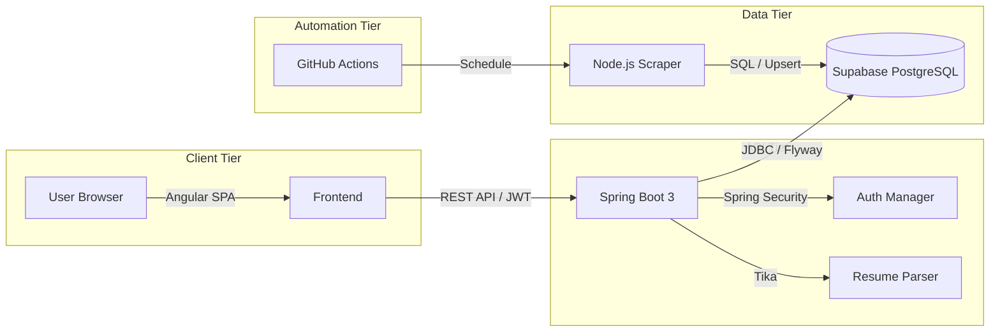
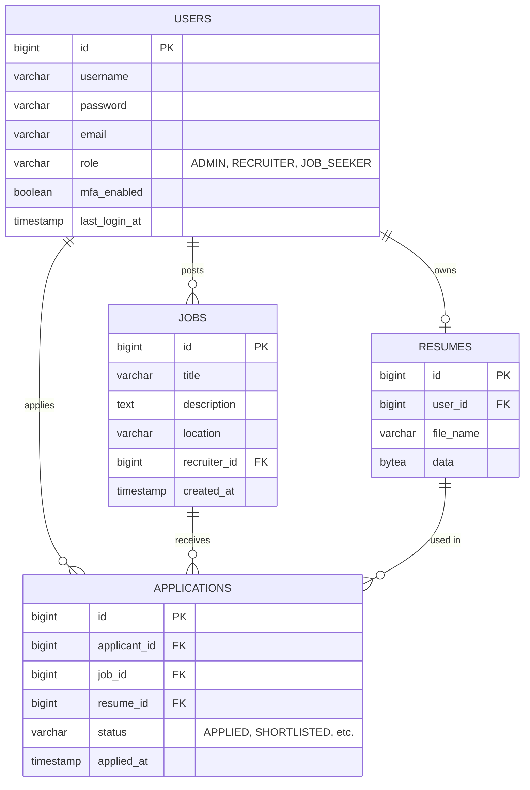

# Smart Job Portal System

[](https://github.com/your-repo/smart-job-portal-system)
[](https://opensource.org/licenses/MIT)
[](https://spring.io/projects/spring-boot)
[](https://angular.io/)
[](https://www.oracle.com/java/)

A modern, production-ready recruitment platform that connects job seekers, recruiters, and administrators with real-time data synchronization and intelligent job scraping.

---

## 📑 Table of Contents

- [About the Project](#about-the-project)
- [Key Features](#key-features)
- [System Architecture](#system-architecture)
- [Role-Based Access Control (RBAC)](#role-based-access-control-rbac)
- [Database Architecture](#database-architecture)
- [Automated Job Scraper](#automated-job-scraper)
- [Project Structure](#project-structure)
- [Technology Stack](#technology-stack)
- [Getting Started](#getting-started)
- [Security](#security)
- [Deployment](#deployment)
- [Troubleshooting](#troubleshooting)
- [License](#license)

---

## 💡 About the Project

The **Smart Job Portal System** is designed to bridge the gap between talent and opportunity. It streamlines the recruitment lifecycle by providing specialized interfaces for different user roles. Whether you are an administrator monitoring system health, a recruiter managing listings, or a job seeker finding your next career move, this platform provides the tools you need.

### Why this project?
- **AI-Ready**: Integrated with Apache Tika for intelligent resume parsing and data extraction.
- **Automated Ecosystem**: Background scrapers ensure the job pool is always fresh without manual intervention.
- **Secure by Design**: Built with modern security standards including JWT, HttpOnly cookies, and granular RBAC.
- **Cloud Native**: Optimized for Supabase (PostgreSQL) for a robust, scalable database experience.

---

## ✨ Key Features

| Feature | Description |
| :--- | :--- |
| **User Lifecycle** | Seamless registration, login, and step-by-step onboarding for all roles. |
| **Job Management** | Full CRUD capabilities for recruiters, including job status tracking and SEO-friendly slugs. |
| **Intelligent Search** | Sophisticated search engine with real-time filtering by location, title, and job type. |
| **Resume Extraction** | Automated processing of PDF/DOCX resumes to populate applicant profiles using Apache Tika. |
| **Application Tracking** | Status-driven workflow (Applied, Shortlisted, Rejected, Hired) for candidates and recruiters. |
| **Admin Control** | Comprehensive dashboard for system health, user auditing, and high-level analytics. |
| **Global Scaling** | Automated ingestion of remote jobs from 7+ major global job boards. |

---

## 🏗 System Architecture

The system follows a modern decoupled architecture where the frontend and backend communicate via a RESTful API.



---

## 🔐 Role-Based Access Control (RBAC)

The system enforces strict security boundaries based on user roles:

- **ADMIN**: 
  - Full visibility into system health and user activities.
  - Management of all job listings and user accounts.
  - Access to analytics dashboards and system configuration.
- **RECRUITER**:
  - Ability to post, edit, and archive job listings.
  - View and manage applications for their specific jobs.
  - Shortlist or reject candidates through the recruitment pipeline.
- **JOB_SEEKER**:
  - Search and browse all active job listings.
  - Upload resumes and maintain a professional profile.
  - Apply to jobs and track application status in real-time.

---

## 📊 Database Architecture

The database is hosted on **Supabase (PostgreSQL)**, with the schema managed by Flyway migrations to ensure consistency across environments.



---

## 🤖 Automated Job Scraper

The scraping engine is a standalone Node.js service that populates the database with fresh opportunities every 12 hours.

- **Sources**: Aggregates data from 7+ sources including **Remotive, ArbeitNow, WeWorkRemotely, Remote.co, HackerNews, RemoteOK, and TheMuse**.
- **Data Normalization**: Cleanses raw HTML, normalizes locations/titles, and removes mojibake.
- **Translation Engine**: Integrated with LibreTranslate to automatically translate non-English job postings into English.
- **Smart Synchronization**:
  1. **Scraper-side Dedupe**: Removes duplicates within the incoming batch.
  2. **Database-side Dedupe**: Performs `UPSERT` operations based on job title and location to prevent stale or duplicate entries.
- **Automation**: Fully managed via GitHub Actions (`job-scraper.yml`) with zero-touch execution.

---

## 📂 Project Structure

```text
smart-job-portal-system/
├── backend/          # Spring Boot 3 Java API
│   ├── src/          # Application source code
│   └── run-*.ps1     # PowerShell execution scripts
├── frontend/         # Angular 17 Single Page Application
│   └── src/app/      # Modular component-based architecture
├── supabase/         # PostgreSQL migrations and seed scripts
├── scripts/          # Operational utility scripts
└── tools/scraper/    # Automated Node.js job scraping engine
```

---

## 🛠 Technology Stack

### Backend
- **Framework**: Spring Boot 3.2.0 (Java 17)
- **Security**: Spring Security 6 (Stateless JWT via HttpOnly Cookies)
- **Data**: Spring Data JPA + Hibernate + Flyway
- **Parsing**: Apache Tika (Resume Extraction)
- **Utilities**: Bucket4j (Rate Limiting), Jsoup (HTML Parsing)

### Frontend
- **Framework**: Angular 17.3 (TypeScript)
- **Styling**: Vanilla CSS (Custom Properties / Flexbox / Grid)
- **Visualization**: Chart.js (Interactive Dashboards)
- **Security**: DOMPurify (XSS Protection), Marked (Markdown Rendering)

### Infrastructure
- **Database**: PostgreSQL (Managed by Supabase)
- **Automation**: GitHub Actions (CI/CD and Scraping)

---

## 🚀 Getting Started

### Prerequisites
- **Java 17+**, **Maven 3.9+**, **Node.js 20.x**

### Local Development Setup
1. **Clone the Repository**: `git clone <repo-url>`
2. **Backend**: 
   - Create `backend/.env` from `.env.example`.
   - Run: `./run-supabase.ps1` (or `mvn spring-boot:run`).
3. **Frontend**: 
   - `cd frontend && npm install && npm start`.
   - Access at `http://localhost:4200`.

---

## 🛡 Security

- **HttpOnly Cookies**: Prevents client-side scripts from accessing JWT tokens.
- **CORS Policies**: Strict origin validation restricted to the frontend application.
- **SQL Injection Protection**: Leverages JPA and prepared statements for all database interactions.
- **Rate Limiting**: Protects authentication endpoints from brute-force attacks.

---

## 📜 License
Distributed under the MIT License. See `LICENSE` for more information.
