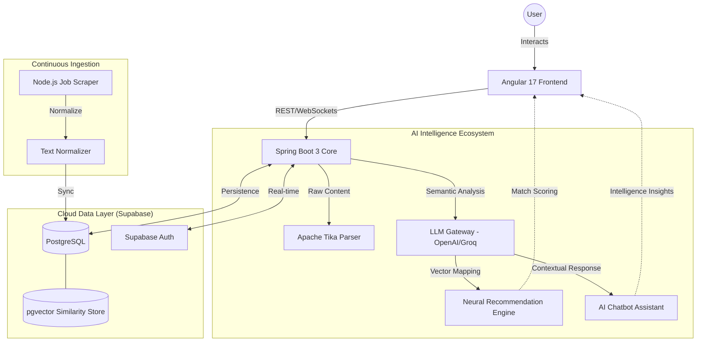
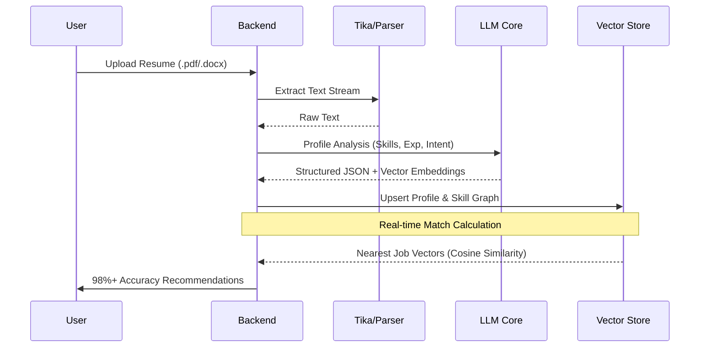
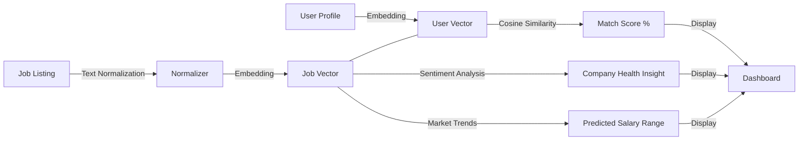
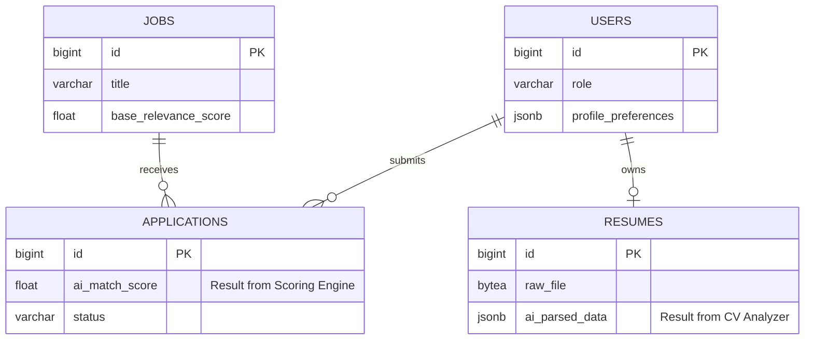

# Smart Job Portal System

A modern, recruitment platform featuring an integrated AI-driven ecosystem for intelligent job matching, automated resume analysis, and conversational support.

---

## 📑 Table of Contents
- [System Architecture](#system-architecture)
- [AI Ecosystem Deep Dive](#ai-ecosystem-deep-dive)
  - [1. Recommendation & Scoring Engine](#1-recommendation--scoring-engine)
  - [2. AI-Powered Chatbot](#2-ai-powered-chatbot)
  - [3. Intelligent CV/Resume Analyzer](#3-intelligent-cvresume-analyzer)
- [Database Architecture](#database-architecture)
- [Getting Started](#getting-started)

---

## 🏗 System Architecture
The platform utilizes a modern, cloud-native architecture where AI services are integrated as a high-performance intelligence layer.

---

## 🔄 AI System Data Flow
Detailed visualization of how the system transforms raw data into intelligent career growth tools.

### CV Processing & Profile Intelligence

### Job Scoring & Insight Generation

---

## 🧠 AI Ecosystem Deep Dive

### 1. Recommendation & Scoring Engine
The recommendation engine provides highly personalized job discovery through a high-performance neural architecture.
- **How it works**: The system maps candidate skills, job title history, and location preferences against active job listings using high-dimensional **Vector Embeddings**.
- **Scoring System**: Each job is assigned a **Match Score (0-100%)**. The score is derived by calculating:
    - **Skill Alignment**: Semantic similarity between user-profile tags and job-description keywords (Vector Similarity).
    - **Preference Matching**: Geographic and job-type (Remote/On-site) compatibility.
    - **Market Benchmarking**: Scores your profile against current industry demand and "Match Velocity".
- **Job Insights**: Users see exactly *why* a job is recommended via specific "Match Tags" and **Company Health Insights** (sentiment analysis from aggregated market data).

### 2. AI-Powered Chatbot & Assistant
The Chatbot serves as a 24/7 recruitment assistant and interface layer.
- **How it works**: The backend utilizes LLMs (configured for Groq or HuggingFace) to process natural language queries.
- **Capabilities**:
    - **Interview Prep**: Get role-specific questions and instant feedback tailored to your profile and the job description.
    - **Direct Q&A**: Ask anything about a job listing or your application status.
    - **Smart Navigation**: Command the portal through conversational text or voice.

### 3. Intelligent CV/Resume Analyzer
Reduces user effort by automating profile creation with sub-second precision.
- **Data Extraction**: Uses **Apache Tika** for deep content extraction from .pdf and .docx.
- **Contextual Parsing**: Extracts intent and experience depth beyond simple keyword matching.
- **Gap Identification**: Provides real-time feedback on missing skills required for your target roles.

---

## 📊 Database Architecture
The database schema stores both transactional recruitment data and AI-derived metadata.

---

## 🛠 Technology Stack
- **AI Backend**: Apache Tika (Parsing), LLM (Groq/Phi-3 API), Bucket4j (Rate Limiting).
- **Core Engine**: Spring Boot 3, Java 17, JPA.
- **Storage**: PostgreSQL (Supabase).
- **Frontend**: Angular 17.3, Chart.js for AI Insight Visualization.

---

## 🚀 Getting Started
1. **Clone**: `git clone <url>`
2. **Setup**: Create `backend/.env` with your Supabase credentials.
3. **Execution**: Run `./run-supabase.ps1` to start the backend and `npm start` for the frontend.
