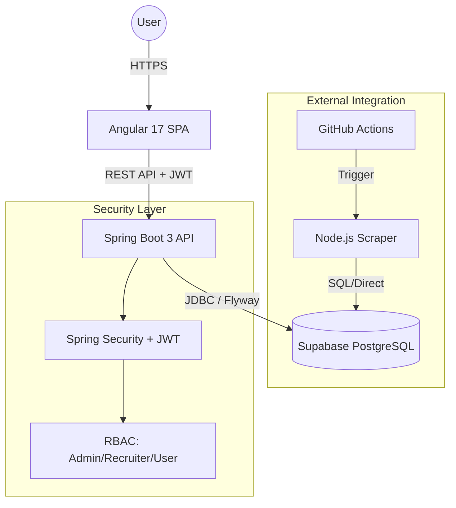
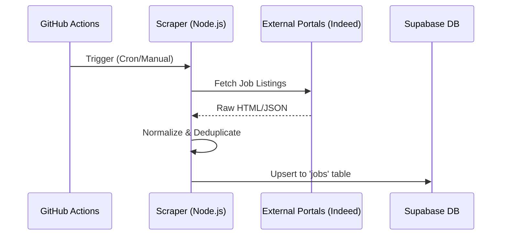

# Smart Job Portal System

[](https://github.com/your-repo/smart-job-portal-system)
[](https://opensource.org/licenses/MIT)
[](https://spring.io/projects/spring-boot)
[](https://angular.io/)
[](https://www.oracle.com/java/)

A modern, production-ready recruitment platform that connects job seekers, recruiters, and administrators with real-time data synchronization and intelligent job scraping.

---

## 📑 Table of Contents

- [About the Project](#about-the-project)
- [Key Features](#key-features)
- [System Architecture](#system-architecture)
- [Project Structure](#project-structure)
- [Technology Stack](#technology-stack)
- [Getting Started](#getting-started)
  - [Prerequisites](#prerequisites)
  - [Local Development Setup](#local-development-setup)
  - [Running with Supabase](#running-with-supabase)
- [Automated Job Scraper](#automated-job-scraper)
- [API Endpoints](#api-endpoints)
- [Security](#security)
- [Deployment](#deployment)
- [Troubleshooting](#troubleshooting)
- [Contributing](#contributing)
- [License](#license)

---

## 💡 About the Project

The **Smart Job Portal System** is designed to bridge the gap between talent and opportunity. It streamlines the recruitment lifecycle by providing specialized interfaces for different user roles. Whether you are an administrator monitoring system health, a recruiter managing listings, or a job seeker finding your next career move, this platform provides the tools you need.

### Why this project?
- **AI-Ready**: Integrated with Apache Tika for intelligent resume parsing.
- **Automated**: Background scrapers ensure the job pool is always fresh.
- **Secure**: Built with modern security standards (JWT, HttpOnly cookies, RBAC).
- **Scalable**: Uses Supabase (PostgreSQL) for a robust cloud-native database experience.

---

## ✨ Key Features

| Feature | Description | Icon |
| :--- | :--- | :---: |
| **Role-Based Access** | Secure separation of concerns for Admins, Recruiters, and Seekers. |  |
| **Job Management** | Full CRUD capabilities with SEO-friendly slugs. |  |
| **Smart Search** | Advanced filtering by location, title, and industry. |  |
| **Resume Parsing** | Automated data extraction from uploaded resumes. |  |
| **Admin Insights** | Real-time analytics and system monitoring dashboard. |  |
| **Automated Scraping** | Background sync from Indeed and other major portals. | 🤖 |

---

## 🏗 System Architecture

The following diagram illustrates the high-level architecture and data flow between the components:



---

## 📂 Project Structure

```text
smart-job-portal-system/
├── backend/          # Spring Boot 3 Java API
│   ├── src/          # Application source code
│   └── run-*.ps1     # PowerShell execution scripts
├── frontend/         # Angular 17 Single Page Application
│   └── src/app/      # Modular component-based architecture
├── supabase/         # PostgreSQL migrations and seed scripts
├── scripts/          # Operational utility scripts
└── tools/scraper/    # Automated Node.js job scraping engine
```

---

## 🛠 Technology Stack

### Backend
- **Framework**: Spring Boot 3.2.0
- **Language**: Java 17
- **Security**: Spring Security 6 (JWT via HttpOnly Cookies)
- **Data**: Spring Data JPA + Hibernate
- **Migrations**: Flyway
- **Parsing**: Apache Tika (Resume Extraction)
- **Scraping**: Jsoup
- **Rate Limiting**: Bucket4j

### Frontend
- **Framework**: Angular 17.3
- **Styling**: Vanilla CSS (Modern CSS variables)
- **Visualization**: Chart.js (Admin Dashboards)
- **Security**: DOMPurify
- **Markdown**: Marked

### Infrastructure
- **Database**: PostgreSQL (Managed by Supabase)
- **Storage**: Supabase Storage
- **Automation**: GitHub Actions

---

## 🚀 Getting Started

### Prerequisites

- **Java 17** (or higher)
- **Maven 3.9** (or higher)
- **Node.js 20.x** (LTS) & npm
- **Supabase CLI** (optional, for local DB development)

### Local Development Setup

#### 1. Clone the Repository
```bash
git clone https://github.com/your-repo/smart-job-portal-system.git
cd smart-job-portal-system
```

#### 2. Backend Configuration
Navigate to `backend/` and create a `.env` file from the example:
```bash
cd backend
cp .env.example .env
```
*Edit `.env` and fill in your Supabase connection strings.*

#### 3. Running the Project

**Using Supabase (Recommended):**
This project is pre-configured to work with Supabase. Ensure your `.env` has `SPRING_PROFILES_ACTIVE=supabase`.
```powershell
./run-supabase.ps1
```

**Standard Local Run:**
```bash
mvn spring-boot:run
```

#### 4. Frontend Setup
```bash
cd ../frontend
npm install
npm start
```
The app will be available at `http://localhost:4200`.

---

## 🤖 Automated Job Scraper

The system includes a robust scraping service to automate content population.



See [tools/scraper/README.md](tools/scraper/README.md) for detailed configuration.

---

## 🛡 Security

- **JWT + Cookies**: Tokens are stored in `HttpOnly`, `SameSite=Strict` cookies to prevent XSS.
- **RBAC**: Endpoints are strictly guarded by `hasRole()` checks.
- **Validation**: Strict server-side validation using JSR-303 (Hibernate Validator).
- **CORS**: Domain-restricted access controlled via backend policy.

---

## 📈 Deployment

### Production Build
1. **Backend**: `mvn clean package -Pprod`
2. **Frontend**: `ng build --configuration=production`

### Hosting Suggestions
- **Backend**: AWS Elastic Beanstalk, Heroku, or Docker/K8s.
- **Frontend**: Vercel, Netlify, or Nginx.
- **Database**: Supabase (Cloud).

---

## 🛠 Troubleshooting

| Issue | Solution |
| :--- | :--- |
| **CORS Errors** | Ensure `CORS_ALLOWED_ORIGINS` in `.env` matches your frontend URL. |
| **Flyway Failed** | Check if the DB schema is clean or manually repair `flyway_schema_history`. |
| **Node mismatch** | Use `nvm` to switch to Node 20. |

---

## 🤝 Contributing

We welcome contributions! Please follow the [standard Git Flow](https://www.atlassian.com/git/tutorials/comparing-workflows/gitflow-workflow).
1. Fork the repo.
2. Create your feature branch (`git checkout -b feature/AmazingFeature`).
3. Commit your changes (`git commit -m 'Add some AmazingFeature'`).
4. Push to the branch (`git push origin feature/AmazingFeature`).
5. Open a Pull Request.

---

## 📜 License
Distributed under the MIT License. See `LICENSE` for more information.
