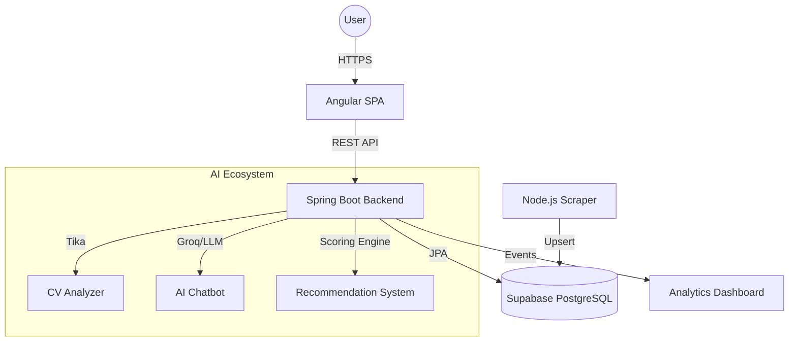

# Smart Job Portal System

[](https://github.com/your-repo/smart-job-portal-system)
[](https://opensource.org/licenses/MIT)
[](https://spring.io/projects/spring-boot)
[](https://angular.io/)
[](https://www.oracle.com/java/)

A modern, production-ready recruitment platform that connects job seekers, recruiters, and administrators with AI-powered insights, real-time data synchronization, and intelligent job scraping.

---

## 📑 Table of Contents

- [About the Project](#about-the-project)
- [Key Features](#key-features)
- [System Architecture](#system-architecture)
- [AI Ecosystem](#ai-ecosystem)
  - [Recommendation System](#recommendation-system)
  - [AI Chatbot](#ai-chatbot)
  - [CV/Resume Analyzer](#cvresume-analyzer)
- [Role-Based Access Control (RBAC)](#role-based-access-control-rbac)
- [Database Architecture](#database-architecture)
- [Automated Job Scraper](#automated-job-scraper)
- [Project Structure](#project-structure)
- [Getting Started](#getting-started)
- [Security](#security)
- [License](#license)

---

## 💡 About the Project

The **Smart Job Portal System** bridges the gap between talent and opportunity using modern AI-driven insights. It streamlines the recruitment lifecycle with an automated, intelligent backend that processes resumes, recommends relevant jobs, and assists users via a specialized AI Chatbot.

---

## ✨ Key Features

| Feature | Description |
| :--- | :--- |
| **Job Lifecycle** | Full CRUD for recruiters with automated status tracking. |
| **Smart Search** | Advanced filtering with real-time analytics. |
| **AI Insights** | Personalized recommendations and conversational assistance. |
| **Automated Ingestion** | Syncs jobs from 7+ sources globally. |

---

## 🏗 System Architecture

The AI-integrated architecture leverages asynchronous processing for data-intensive tasks.



---

## 🧠 AI Ecosystem

### 1. Recommendation System
The Recommendation System scores jobs against user profiles using a weighted matching algorithm.
- **Scoring Engine**: Evaluates job skills, location preferences, and career history.
- **Job Insights**: Provides a "Match Score" (%) to users based on how well their profile aligns with the job description.

### 2. AI Chatbot
A specialized conversational assistant that helps users:
- Navigate the portal and explain the recruitment process.
- Answer questions about application statuses.
- Provide career advice and interview preparation tips.
- **Technology**: Built using LLMs (Llama-3/Phi-3) with a fallback architecture to ensure high availability.

### 3. CV/Resume Analyzer
- **Data Extraction**: Uses **Apache Tika** to convert PDF/DOCX into machine-readable text.
- **Parsing**: Extracts contact information, work experience, and core competencies.
- **Profiling**: Automatically populates the user's dashboard to reduce manual data entry.

---

## 🔐 Role-Based Access Control (RBAC)

- **ADMIN**: Full visibility, user management, and system health monitoring.
- **RECRUITER**: Manage job postings and shortlist applicants.
- **JOB_SEEKER**: Manage profile, search jobs, and track AI-recommended opportunities.

---

## 📊 Database Architecture

The schema facilitates deep relational mapping between users, jobs, and AI-generated insights.

```mermaid
erDiagram
    USERS ||--o{ APPLICATIONS : "applies"
    USERS ||--o| RESUMES : "owns"
    JOBS ||--o{ APPLICATIONS : "receives"
    
    USERS { bigint id; varchar email; varchar role; }
    JOBS { bigint id; varchar title; text description; }
    APPLICATIONS { bigint id; varchar status; float match_score; }
    RESUMES { bigint id; bytea data; jsonb parsed_data; }
```

---

## 🤖 Automated Job Scraper
- **Sources**: Indeed, Remotive, WeWorkRemotely, etc.
- **Translation**: Auto-translated to English via LibreTranslate.
- **Upsert Logic**: Intelligent deduplication based on location and title.

---

## 🛠 Technology Stack

### Backend
- **Framework**: Spring Boot 3.2.0 (Java 17)
- **AI/Parsing**: Apache Tika, Groq/HuggingFace LLM integration
- **Data**: JPA, Flyway, Supabase (PostgreSQL)

### Frontend
- **Framework**: Angular 17.3
- **Features**: Chart.js for Insights, DOMPurify for security.

---

## 🚀 Getting Started
1. Clone the repo.
2. Configure `backend/.env`.
3. Run: `./run-supabase.ps1`.

---

## 📜 License
Distributed under the MIT License.
