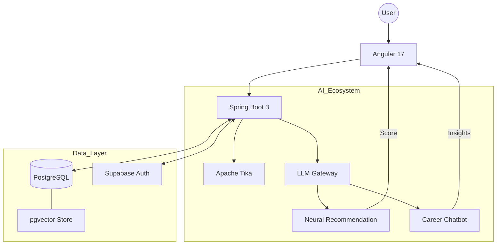
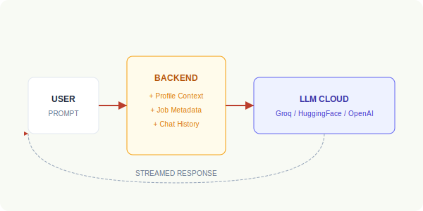
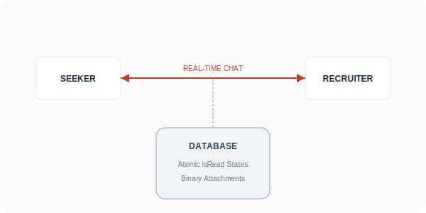
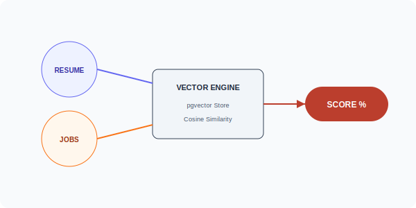
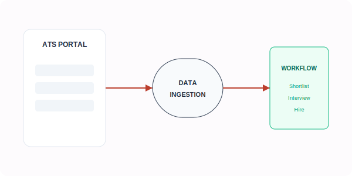
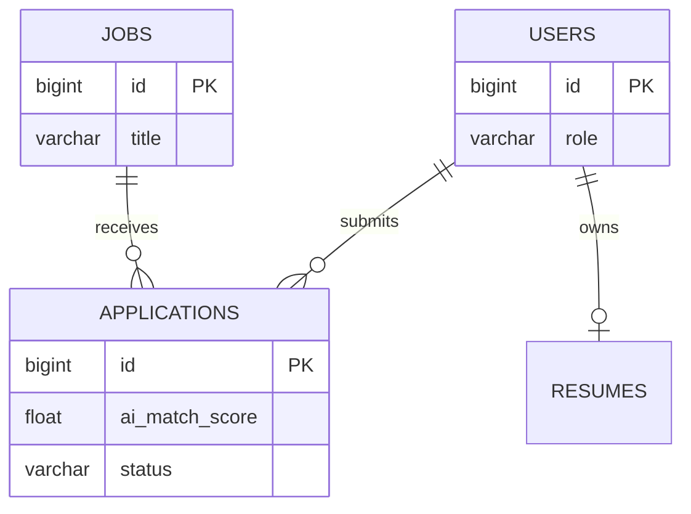

# Vecta: AI-Powered Talent Ecosystem

A modern, recruitment platform featuring an integrated AI-driven ecosystem for intelligent job matching, automated resume analysis, and conversational support.

---

## 📑 Table of Contents
- [System Architecture](#system-architecture)
- [AI Ecosystem Deep Dive](#ai-ecosystem-deep-dive)
  - [1. Recommendation & Scoring Engine](#1-recommendation--scoring-engine)
  - [2. AI-Powered Chatbot](#2-ai-powered-chatbot)
  - [3. Intelligent CV/Resume Analyzer](#3-intelligent-cvresume-analyzer)
- [Database Architecture](#database-architecture)
- [Getting Started](#getting-started)

---

---

## 🏗 System Architecture
The platform utilizes a modern architecture where AI services are integrated as a high-performance intelligence layer.

---

## 💬 AI Career Assistant
The portal features an integrated **Conversational AI Assistant** that acts as your personal career coach.

  

### How it Works (Architecture):
1. **Contextual Awareness**: Every message sent to the assistant is automatically wrapped with a "System Context" that includes your skills, experience level, and the specific details of the job you are currently viewing.
2. **Provider Fallback Logic**: To ensure 100% availability, the assistant utilizes a triple-provider fallback system:
    - **Primary**: Groq (Llama 3.1 70B) for lightning-fast, high-reasoning responses.
    - **Secondary**: Hugging Face (Phi-3) for reliable text generation.
    - **Tertiary**: OpenRouter (Llama 3.2) as a safety layer.
3. **Response Streaming**: Responses are streamed to the Angular frontend in real-time, providing an interactive and responsive chat experience.

---

## ✉️ Direct Messaging (Recruiter ↔ Seeker)
Bridge the communication gap with high-context direct messaging. No more "black hole" applications.

  

### How it Works (Architecture):
1. **Relational Persistence**: Messages are stored in a dedicated PostgreSQL table that maintains a hard link between the `sender_id`, `receiver_id`, and `job_id`. This allows the UI to automatically organize conversations by job title.
2. **Read-Receipt Synchronization**: The system uses an atomic state management approach to track `isRead` status, ensuring that unread counts are synchronized across the seeker's dashboard and the recruiter's ATS.
3. **Attachment Layer**: Resumes and documents are stored as `bytea` binary data in the database with a metadata reference, allowing for secure, authenticated downloads within the chat bubble.

---

## 🧠 AI Ecosystem Deep Dive

### 1. Recommendation & Scoring Engine
The recommendation engine provides highly personalized job discovery through a high-performance neural architecture.

  

- **Neural Mapping**: The system transforms candidate skills and job descriptions into high-dimensional **Vector Embeddings**.
- **Vector Search**: Utilizing **pgvector** in PostgreSQL, the engine performs a **Cosine Similarity** search across thousands of roles in milliseconds.
- **Scoring Logic**: The final Match Score (0-100%) is a weighted composite of Semantic Similarity, Location compatibility, and Experience-level alignment.

### 2. Intelligent CV/Resume Analyzer
Reduces user effort by automating profile creation with sub-second precision.

- **Deep Parsing**: Powered by **Apache Tika**, the system performs raw content extraction from .pdf and .docx files, stripping away formatting to reach core data.
- **Entity Extraction**: An LLM-based parser then identifies "Entities" (Skills, Previous Companies, Education) from the raw text to automatically populate the user's profile.

---

## 🏢 Recruiter Ecosystem
Empowering hiring teams with structured data and efficient workflows.

  

- **Structured Job Ingestion**: Move beyond "text-only" descriptions. Every job posted captures precise requirements (Job Type, Salary, Work Mode) which are immediately indexed for the vector search engine.
- **Applicant Tracking (ATS)**: Recruiters have a dedicated workflow to manage candidates from the "Applied" state through "Shortlisted" to "Hired", with full access to AI-derived compatibility metrics.

---

## 📊 Database Architecture
The database schema stores both transactional recruitment data and AI-derived metadata.

---

## 🛠 Technology Stack
- **AI Backend**: Apache Tika (Parsing), LLM (Groq/Phi-3 API), Bucket4j (Rate Limiting).
- **Core Engine**: Spring Boot 3, Java 17, JPA.
- **Storage**: PostgreSQL (Supabase).
- **Frontend**: Angular 17.3, Chart.js for AI Insight Visualization.

---

## 🚀 Getting Started
1. **Clone**: `git clone <url>`
2. **Setup**: Create `backend/.env` with your Supabase credentials.
3. **Execution**: Run `./run-supabase.ps1` to start the backend and `npm start` for the frontend.
